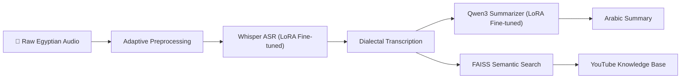

# 🎙️ Egyptian Arabic Audio-to-Intelligence Pipeline

[](https://github.com/Mahmoud2592004/Audio-Retrieval)
[](https://huggingface.co/openai/whisper-small)
[](https://huggingface.co/Qwen/Qwen3-VL-4B-Instruct)
[](#-memory-optimization-4gb-vram)

An end-to-end intelligence pipeline designed for **Egyptian Arabic (عامية مصرية)**. This system transcribes raw dialectal audio, generates abstractive summaries using a fine-tuned LLM, and enables semantic search across a YouTube-based knowledge base.

---

## 🚀 Overview

This project addresses the unique challenges of Egyptian Arabic speech processing, including dialectal variations, noisy recordings, and high computational costs. By combining fine-tuned state-of-the-art models with a custom adaptive preprocessing engine, the pipeline delivers high-fidelity intelligence even on consumer-grade hardware (4GB VRAM).

### Key Workflows:
1.  **Adaptive Preprocessing:** Quality-based routing (SNR scoring) to optimize denoising and normalization.
2.  **Dialectal ASR:** Transcription via a fine-tuned **Whisper-Small** model using LoRA.
3.  **Abstractive Summarization:** Contextual summarization via a fine-tuned **Qwen3-VL-4B** model.
4.  **Semantic RAG:** Vector search over YouTube transcripts using **FAISS** and **BGE-M3** embeddings.

---

## 🏗️ System Architecture



---

## 🧠 Technical Deep Dive

### 1. Adaptive Audio Pipeline
Unlike static pipelines, this system employs **Quality-Based Routing**. Every audio file is analyzed for Signal-to-Noise Ratio (SNR) and assigned to a Tier (Excellent to Poor), which determines the intensity of processing:
*   **Denoising:** SpeechBrain MetricGAN+ with adaptive blending.
*   **Normalization:** Tier-dependent Peak/RMS normalization.
*   **VAD:** Silero VAD (Neural) with energy-based fallback for robust segmenting.
*   **Segmentation:** Pause-based intelligent chunking (0.5s to 30s).

### 2. Whisper Fine-Tuning (ASR)
The model was fine-tuned on a custom dataset of Egyptian Arabic WAV/TXT pairs using **4-bit QLoRA**.
*   **Base:** `openai/whisper-small` (244M params).
*   **Technique:** PEFT/LoRA (Rank 32, Alpha 64).
*   **Optimization:** Gradient checkpointing enabled to fit in 4GB VRAM during training.
*   **Result:** High accuracy on colloquial terms like *"النهاجدة"* (النهاردة) and *"مش فاضي"*.

### 3. Summarization Fine-Tuning
A **Qwen3-VL-4B** model was fine-tuned to transform raw transcriptions into concise Egyptian Arabic summaries.
*   **Phase:** 2-phase training reaching a final loss of **~0.8**.
*   **Format:** 4-bit NF4 quantization + LoRA adapter (66.1 MB).
*   **Capability:** Handles noisy input gracefully and preserves dialectal nuance.

### 4. Semantic Search (RAG)
Integrated a Retrieval-Augmented Generation component:
*   **Embeddings:** `BAAI/bge-m3` (1024-dim).
*   **Vector DB:** FAISS flat index for millisecond retrieval.
*   **Features:** Clickable YouTube source linking in the UI.

---

## ⚡ Memory Optimization (4GB VRAM)

A core engineering achievement of this project is running heavy LLM and ASR models on limited hardware:
*   **Sequential Loading:** Models are loaded into VRAM only when needed, then purged using `gc.collect()` and `torch.cuda.empty_cache()`.
*   **4-Bit Quantization:** Leveraging `bitsandbytes` (NF4) for 75% memory reduction.
*   **Subprocess Isolation:** The summarizer runs in a separate worker process to prevent CUDA context fragmentation.
*   **CPU Offloading:** Non-critical layers are spilled to system RAM/Disk to prevent OOM crashes.

---

## 📂 Project Structure

```bash
Project-2-Audio/
├── egypt_audio/           # Core Pipeline & ASR
│   ├── modules/           # VAD, Denoising, Normalization, Scoring
│   ├── finetuning/        # Whisper training scripts & adapters
│   └── pipeline.py        # Orchestrator
├── summarization/         # Qwen3 Summarizer
│   ├── finetuned_model/   # LoRA adapter
│   └── run_summarization.py
├── rag/                   # FAISS Semantic Search
│   ├── search_engine.py
│   └── youtube_transcript.faiss
├── audio_intelligence_app.py # Streamlit UI
└── audio_intelligence_web.py # FastAPI Backend
```

---

## 🛠️ Installation & Usage

1. **Clone the Repo:**
   ```bash
   git clone https://github.com/Mahmoud2592004/Audio-Retrieval.git
   cd Audio-Retrieval
   ```

2. **Setup Environment:**
   ```bash
   python -m venv .venv
   source .venv/bin/activate  # Or .venv\Scripts\activate on Windows
   pip install -r requirements.txt
   ```

3. **Launch the UI:**
   ```bash
   streamlit run audio_intelligence_app.py
   ```

---

## 🌟 Results

| Task | Input Sample | Output Sample |
| :--- | :--- | :--- |
| **ASR** | [Egyptian Audio] | "والله أنا جمعتكوا النهاجدة علشان أنا مش فاضي بكرا" |
| **Summary** | "أنا النهاردة رحت الشغل وكان يوم متعب جدا..." | "الزحام المروري والمساءلة عن الوقت" |

---

## 📝 Future Roadmap
- [ ] Implement formal WER/ROUGE benchmarking.
- [ ] Containerization (Docker) for easier deployment.
- [ ] Improve dialectal orthography normalization.
- [ ] Add support for real-time streaming transcription.

---

**Developed for NLP Course — 4th Year, 2nd Term.**  
*By Mahmoud, Abdullah — 2025*
